# 🧠 Fraud Detection MLOps Platform

Welcome to the **Fraud Detection MLOps Platform**, a production-ready cloud-native system that includes:

* **Azure Kubernetes Service (AKS)** for scalable deployment
* **Helm** for Kubernetes release management
* **Azure Container Registry (ACR)** for container storage
* **Jenkins / GitHub Actions** for CI/CD
* **Docker Buildx** for multi-architecture image builds
* **FastAPI** for real-time fraud prediction
* **Prometheus & Grafana** for monitoring and observability

This project follows a documentation structure inspired by top engineering organizations such as **Stripe**, **Airbnb**, **Coinbase**, and **Shopify**.

---

## 🚀 End-to-End MLOps Lifecycle Flow

Below is the complete lifecycle of the Fraud Detection platform — from model development, to API serving, CI/CD automation, container registry, Kubernetes deployment, monitoring, and finally the user request/response lifecycle.

```mermaid
flowchart LR

    %% ======= ML Stage =======
    subgraph ML[Stage 1: Machine Learning]
        Train[Train Fraud Model]
        Export[Export Model - model.pkl]
    end

    %% ======= FastAPI Stage =======
    subgraph API[Stage 2: FastAPI Application]
        FastAPI[FastAPI App]
        Gunicorn[Gunicorn Runner]
    end

    %% ======= Docker Build =======
    subgraph Docker[Stage 3: Docker Build]
        DFile[Dockerfile]
        Buildx[Docker Buildx]
    end

    %% ======= GitHub Actions =======
    subgraph CI[Stage 4: GitHub Actions CICD]
        Repo[GitHub Repo]
        Actions[deploy.yml Workflow]
        ACR[Azure Container Registry]
    end

    %% ======= Infrastructure =======
    subgraph Infra[Stage 5: Terraform Infra]
        TF[Terraform Creates AKS and ACR]
    end

    %% ======= Helm + AKS Deployment =======
    subgraph Deploy[Stage 6: Helm and Kubernetes]
        Helm[Helm Chart]
        AKS[Azure Kubernetes Service]
        DeployYAML[K8s Deployment]
        Service[K8s Service - ClusterIP]
        Ingress[Ingress Controller]
        Pods[fraud-api Pods]
    end

    %% ======= Monitoring =======
    subgraph Monitor[Stage 7: Monitoring]
        Prom[Prometheus metrics]
        Graf[Grafana Dashboards]
    end

    %% ======= User Flow =======
    subgraph UserFlow[Stage 8: User API Flow]
        User[Client or Merchant]
        Predict[POST /predict]
    end

    %% ======= Connections =======

    Train --> Export --> FastAPI --> Gunicorn --> DFile --> Buildx

    Repo --> Actions
    Actions -->|Build and Push| ACR
    Buildx -->|Push Image| ACR

    TF --> AKS

    ACR -->|Pull Image| Helm
    Helm --> AKS --> DeployYAML --> Pods
    Pods --> Service --> Ingress

    User -->|POST /predict| Predict --> Ingress
    Ingress --> Service --> Pods
    Pods -->|JSON Response| User

    Pods -->|metrics| Prom --> Graf
```



```

---

## 🏗️ System Architecture

A deep dive into the internal architecture: CI/CD, deployments, networking, pods, and observability.

👉 **[docs/architecture/mlops-system-architecture.md](docs/architecture/mlops-system-architecture.md)**

This includes:

* CI/CD pipeline flow
* Docker image creation using Buildx
* ACR storage and image retrieval
* Helm chart deployment
* AKS pods, services, ingress
* Prometheus + Grafana monitoring loop

---

## 🌐 User Request Flow

Shows how an external client interacts with the Fraud API—ideal for product teams and external consumers.

👉 **[docs/api/user-flow.md](docs/api/user-flow.md)**

This includes:

* `/predict` endpoint request lifecycle
* Ingress routing
* Service → Pod balancing
* Response path back to the user

---

## 📁 Project Structure

Below is the accurate structure extracted directly from the GitHub repository:

```
mlops-fraud-detection/
├── .github/                     # GitHub Actions workflows (CI/CD)
│
├── Infra/
│   └── terraform/               # Terraform IaC for AKS, ACR, Networking
│
├── Jenkins/                     # Jenkins pipeline files, Kaniko integration
│
├── K8S/                         # Raw Kubernetes manifests (legacy / deprecated)
│
├── ML/                          # ML models, preprocessing, training artifacts
│
├── app/                         # FastAPI application source code
│
├── docs/
│   ├── architecture/            # System architecture documentation
│   │   ├── mlops-system-architecture.md
│   │   ├── mlops-system-architecture.png
│   │   └── mlops-system-architecture.drawio
│   │
│   └── api/                     # User request flow documentation
│       ├── user-flow.md
│       ├── user-flow.png
│       └── user-flow.drawio
│
├── helm/                        # Helm chart for fraud-api deployment
│
├── Dockerfile                   # Container build definition
├── Jenkinsfile                  # CI/CD pipeline for Jenkins
├── gunicorn_conf.py             # Gunicorn configuration for FastAPI
├── ingress-controller-svc.yaml  # Ingress controller configuration (manual apply)
├── jenkins-pvc-backup.yaml      # Jenkins PVC backup configuration
├── requirements.txt             # Python package dependencies
├── environment.yml              # Conda environment definition
├── .dockerignore
├── .gitignore
└── README.md
```

---

## 🚀 Getting Started

1. Clone the repository
2. Build and push your Docker image using Buildx
3. Deploy using Helm
4. Monitor using Grafana dashboards

---

## 📊 Monitoring & Observability

* **Prometheus** scrapes metrics from the FastAPI `/metrics` endpoint
* **Grafana** visualizes dashboards & alerts

---

## 🤝 Contributing

Contributions are welcome! Please open a PR to propose improvements.

---

## 📄 License

MIT License
