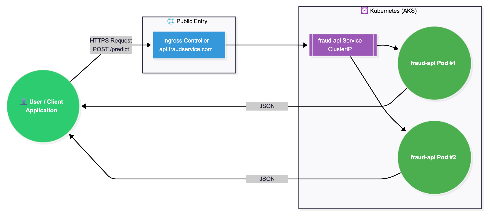

# 🌐 User Request Flow (Fraud API)

This document explains how a user request flows through the Fraud Detection platform —
from the moment a client hits the public API endpoint to the final JSON response.

---

## 📘 User Flow Diagram



The diagram illustrates the following sequence:

1. A user or external client sends a request to the **fraud API endpoint**  
2. The request reaches the **Ingress Controller**  
3. The Ingress forwards traffic to the internal **fraud-api Service**  
4. Kubernetes routes the request to one of the running **fraud-api Pods**  
5. The pod processes the request and returns a **JSON response** back through the same path

---

## 🔁 Flow Breakdown

### **1. User / Client**
The caller can be:
- A web frontend
- A mobile app
- A merchant backend
- A batch risk engine

They send an HTTPS request to:
POST https://api.fraudservice.com/predict

---

### **2. Ingress Controller (Nginx)**
- Entry point to the AKS cluster  
- Handles TLS/HTTPS  
- Routes based on hostname and path  
- Forwards traffic to:  
  `fraud-api-service.default.svc.cluster.local`

---

### **3. Kubernetes Service (fraud-api Service)**
- Internal stable endpoint  
- Performs load balancing across Fraud API pods  
- Ensures requests are distributed correctly

---

### **4. Fraud API Pods**
Each pod:
- Hosts the fraud detection model  
- Runs your FastAPI app  
- Executes inference  
- Returns JSON response

Kubernetes may run **1+ pods** depending on replica count.

---

### **5. Response Back to User**
The response flows:
Pod → Service → Ingress → User


---

## 📦 Example Request

```bash
POST /predict
Content-Type: application/json

{
  "amount": 189.70,
  "transaction_type": "online",
  "merchant_id": "AMZ112201"
}

📦 Example Response
{
  "fraud_score": 0.91,
  "is_fraud": true,
  "explanation": "Unusual merchant + high amount"
}


