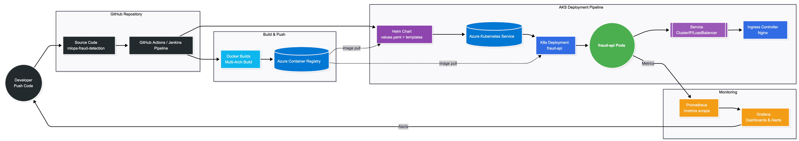

# 🏗️ MLOps System Architecture

This document describes the full production architecture of the Fraud Detection MLOps Platform.  
It includes CI/CD, image building, container registry, Kubernetes deployment, and observability.

---

## 📐 High-Level Architecture Diagram

---

## 📦 Components Overview

### 1. Source Control (GitHub)
- Stores application code and Helm charts
- Triggers CI pipeline on push

### 2. CI Pipeline (Jenkins / GitHub Actions)
- Builds multi-arch Docker images using `buildx`
- Pushes image to Azure Container Registry (ACR)

### 3. Azure Container Registry (ACR)
- Holds application image: `fraud-api:<tag>`
- Pulls from CI and serves images to AKS

### 4. Helm Deployment (values.yaml + templates)
- Deploys:
  - Deployment
  - Service
  - Ingress
  - ConfigMaps
  - Secrets

### 5. Azure Kubernetes Service (AKS)
- Runs fraud-api pods
- Uses Nginx ingress
- Internal service load balancing

### 6. Observability
- Prometheus scrapes `/metrics`
- Grafana dashboards for alerts and visualization

---

## 🔄 Deployment Workflow Summary

1. Developer pushes code → GitHub  
2. CI builds Docker image using Buildx  
3. CI pushes image → ACR  
4. Helm deploys updated chart → AKS  
5. Kubernetes schedules pods  
6. Prometheus & Grafana monitor the app  
7. Alerts sent back to developers
